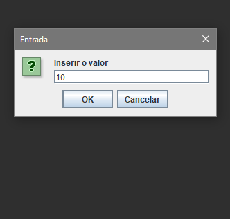
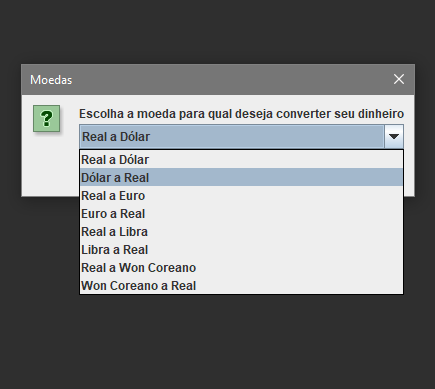
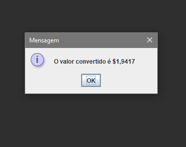

# Conversor de unidades

O conversor de unidades foi criado para realizar a conversão de valores em moedas, temperaturas, distâncias, etc.

## Status

## Funcionalidades

- Conversor de moedas: Real, Dólar, Euro, Libra e Won coreano.
Tela para seleção do tipo de conversor:

Tela para inserir o valor a converter:

Tela para selecionar as moedas utilizadas na conversão:

Tela mostrando resultado:

## Tecnologia:

- Java Swing

